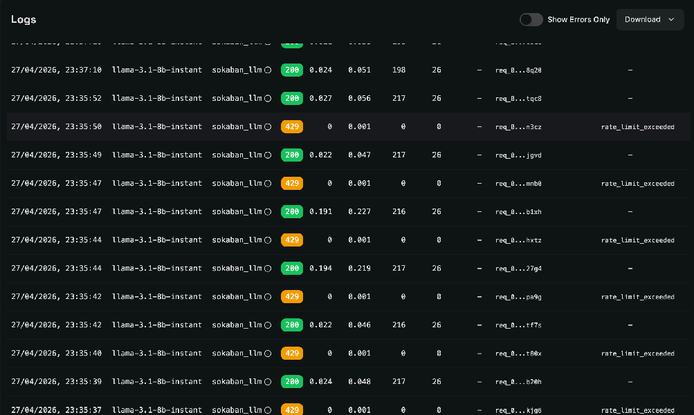
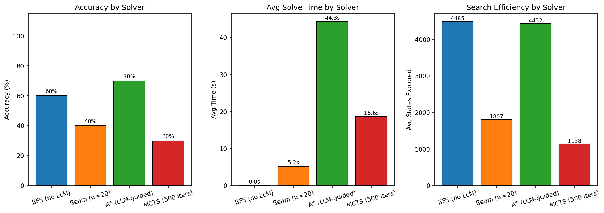
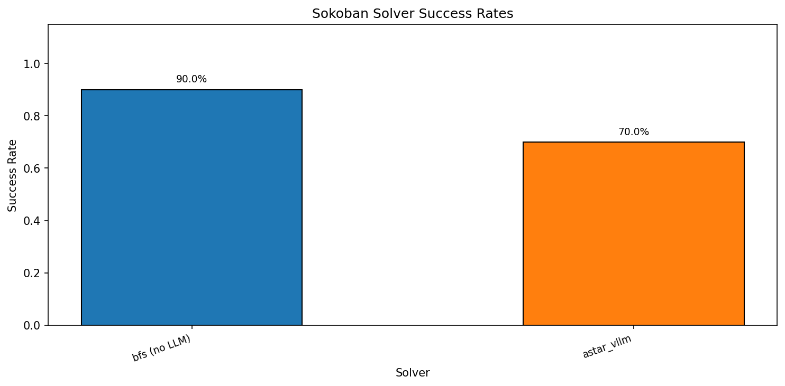
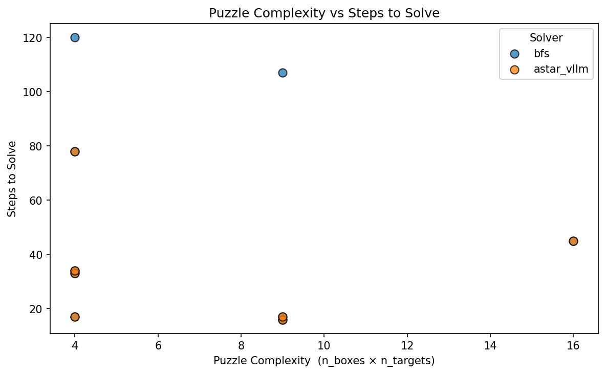

# Analysis Report — Track 1: Tree-Based Planning with LLMs

**System:** Sokoban solver using an LLM as a one-step action predictor, combined with A*, Beam Search, BFS, and MCTS tree search algorithms.  
**Final Hardware:** AMD Instinct MI300X (192 GB HBM3), ROCm 7.2, vLLM with continuous batching, Qwen2.5-7B-Instruct.  
**Backends explored:** Groq API → MLX (Apple Silicon) → vLLM (AMD MI300X).  
**Models explored:** Qwen2.5-1.5B, Qwen2.5-3B, Qwen2.5-7B, Claude Sonnet 4.6.  
**Dataset:** David Skinner's Microban collection ([Link](http://www.abelmartin.com/rj/sokobanJS/Skinner/David%20W.%20Skinner%20-%20Sokoban_files/Microban.txt)). Final evaluation: 10 puzzles spanning easy to hard: puzzle indices [0, 1, 5, 10, 20, 30, 50, 70, 90, 110].

---

## 1. System Architecture

### 1.1 Overall Design

The system follows a strict constraint: **the LLM is used only as a one-step predictor**. At each board state, it receives a prompt describing the current configuration and outputs a single best action (`up`, `down`, `left`, `right`) from the current state to reach the goal. The tree search algorithm decides which states to visit and when to call the LLM — the LLM never plans ahead or reasons about future states.

```
Board State → Prompt Builder → vLLM (Qwen2.5-7B) → Action + Confidence
                ↑                                         ↓
           representation.py                    A* priority queue
```

### 1.2 Modules

| Module | Responsibility |
|--------|---------------|
| `parser.py` | Parses raw Microban.txt into structured puzzle dicts |
| `environment.py` | Immutable `SokobanState`, action application, deadlock detection, heuristic |
| `representation.py` | Three LLM prompt formats: ASCII, Structured, Annotated |
| `llm_predictor.py` | vLLM client, batch inference, logprob scoring, state cache |
| `search.py` | BFS baseline, Beam Search, A* with LLM guidance, MCTS |
| `evaluation.py` | Batch evaluation, metrics, plots |

### 1.3 LLM Integration

The LLM receives the full board prompt and the server returns logprobs over output tokens. The system scans **all output token positions** for action words and extracts their log-probabilities — not just the first token. This means even when the model responds in JSON format (`{"action": "up"}`), the correct token's probability is captured.

```python
# f-score formula in A*
priority = g_cost - heuristic_score(state) - llm_weight * llm_prob - push_bonus
```

The LLM probability (`llm_prob`) acts as a small tiebreaker. If the LLM is wrong, the correct path is still explored — just slightly later by considering the valid actions as the fallback.

---

## 2. State Representations

Three representations were implemented and compared:

### ASCII
Raw board grid using standard Sokoban symbols:
```
####
# .#
#  ###
#*@  #
#  $ #
#  ###
####
```

### Structured
Coordinate-based text description with no grid:
```
Board size: 7 rows x 6 cols
Player position: row 3, col 2 (index starts from 0)
Box positions: [(3, 1), (4, 3)]
Target positions: [(1, 2), (3, 1)]
Unplaced boxes: [(4, 3)]
Unmatched targets: [(1, 2)]
```

### Annotated
ASCII grid augmented with Manhattan distance hints:
```
####
# .#
#  ###
#*@  #
#  $ #
#  ###
####
--- Hints ---
Player is at (3, 2).
Box at (4, 3) → nearest target at (1, 2), distance 4 steps.
1 of 2 boxes already on targets.
```

### 2.1 Representation Experiment Results

All three representations were tested with A* on the same 10 puzzles (max 20,000 states, 20,000 LLM calls):

| Representation | Solved | Accuracy | Avg Steps | Avg States | Avg LLM Calls | Avg Time |
|---|---|---|---|---|---|---|
| ASCII | 8/10 | 80.0% | 45.0 | 6,594 | 6,594 | 68.2s |
| Structured | 8/10 | 80.0% | 45.0 | 6,608 | 6,608 | 63.3s |
| Annotated | 8/10 | 80.0% | 45.0 | 6,592 | 6,592 | 67.6s |

**Finding:** All three representations achieved identical accuracy (80%) with the same 8 puzzles solved and the same 2 failures (puzzles 5 and 110). Step counts and state counts are nearly identical across representations.

**Interpretation:** Qwen2.5-7B is robust to representation format at this difficulty level. The two failures are **budget-constrained** (both hit the 20k state limit), not representation-dependent. The model's spatial reasoning is sufficient to interpret any of the three formats.

**When representation would matter:** Differences would emerge at the margin — puzzles where one representation gives just enough extra signal to tip the solver over the budget threshold. With the current puzzle set, no puzzle is at that margin.

---

## 3. Search Strategy Comparison

Four search algorithms were compared on the same 10 puzzles:

### 3.1 BFS (Baseline, No LLM)

Standard breadth-first search exploring all reachable states. Complete within its budget — if the solution exists and the state cap is not hit, BFS will find it.

**Properties:**
- Zero LLM calls → negligible latency per state
- Explores states in order of path length (optimal solution length)
- Fails only when the budget cap (max_states) is hit before the solution is found

### 3.2 Beam Search (LLM-guided)

Maintains a fixed-size "beam" of the top-k states at each depth level. LLM ranks candidate actions; only the top-k resulting states survive to the next step.

**Properties:**
- Permanently prunes states — cannot recover from bad pruning decisions
- Sokoban requires counter-intuitive moves (pushing boxes *away* from goals to set up future pushes); beam search scores these moves low and discards them
- Memory efficient but fundamentally incomplete since once its discards any move it cannot visit the same state back again since it will discard that move.

### 3.3 A* (LLM-guided, batched)

Priority queue search where every candidate state is retained until visited. The LLM biases expansion order via a small priority boost, but never eliminates candidates.

**Properties:**
- Complete within budget (guaranteed to find solution if one exists and cap not hit)
- Batched LLM calls: pops `batch_size=16` states at once, fires all HTTP requests concurrently
- State caching: identical board positions reuse cached predictions
- Deadlock pruning: corner-deadlock states discarded before entering the heap

### 3.4 MCTS (LLM-guided Monte Carlo Tree Search)

Builds a search tree using four phases per iteration: **Select** (PUCT-guided tree walk), **Expand** (LLM priors on child actions), **Rollout** (heuristic-guided random simulation), **Backpropagate** (update visit counts and rewards).

**Properties:**
- LLM provides action priors via `llm_prior` field in each tree node, biasing PUCT selection toward LLM-favored moves
- Rollouts use an 80/20 heuristic/random policy — picks the action with best heuristic score 80% of the time, random 20% to escape local optima
- Global visited set prevents cycles across the entire tree
- Reward signal: 1.0 for solved, 0.0 for deadlock, 0.5 ± improvement for partial rollouts
- Exploration-exploitation balance via PUCT formula: `Q(n) + c × prior × √(parent.visits) / (1 + n.visits)`

### 3.5 Results Summary

Experiment settings: 10 puzzles [0,1,5,10,20,30,50,70,90,110], `max_states=10,000`, `max_llm_calls=10,000`, `beam_width=20`, `mcts_iterations=500`, model: Qwen2.5-7B-Instruct via vLLM.

| Solver | Solved | Accuracy | Avg Steps | Avg States | Avg LLM Calls | Avg Time |
|---|---|---|---|---|---|---|
| BFS (no LLM) | 6/10 | 60.0% | 32.5 | 4,485 | 0 | 0.03s |
| Beam Search (w=20) | 4/10 | 40.0% | 20.8 | 1,807 | 704 | 5.22s |
| A* (LLM-guided) | 7/10 | 70.0% | 34.3 | 4,432 | 4,432 | 44.29s |
| MCTS (500 iters) | 3/10 | 30.0% | 25.0 | 1,138 | 394 | 18.63s |

**Per-puzzle MCTS breakdown:**

| Puzzle | Boxes | Solved | Steps | States | LLM Calls | Time |
|---|---|---|---|---|---|---|
| 0 | 2 | ✅ | 37 | 843 | 222 | 10.27s |
| 1 | 3 | ❌ | — | 1,259 | 466 | 21.95s |
| 5 | 3 | ❌ | — | 1,234 | 434 | 20.72s |
| 10 | 2 | ❌ | — | 1,130 | 442 | 20.57s |
| 20 | 2 | ✅ | 17 | 939 | 307 | 14.12s |
| 30 | 3 | ✅ | 21 | 1,282 | 445 | 20.81s |
| 50 | 2 | ❌ | — | 958 | 312 | 14.56s |
| 70 | 2 | ❌ | — | 1,154 | 425 | 20.16s |
| 90 | 4 | ❌ | — | 1,299 | 443 | 21.19s |
| 110 | 6 | ❌ | — | 1,277 | 448 | 22.00s |

**Key observations:**

1. **Astar achieves the highest accuracy (70%) under a tight 10k state budget.** BFS (60%), beam search (40%), and MCTS (30%) all score lower. This directly demonstrates LLM guidance value: A* and BFS explore nearly identical state counts (~4,400–4,500 avg) but A* solves one extra puzzle — the LLM steers it toward the solution before the cap is hit.

2. **BFS drops to 60% under the 10k budget** (from 90% at 50k budget). Its failures are purely budget-constrained — it ran out of states before finding solutions on harder puzzles. With an unlimited budget, BFS would eventually solve all these puzzles.

3. **Beam search achieves 40% accuracy** despite using only 1,807 avg states (well under the 10k cap). It did not run out of budget — the beam **collapsed**. The correct solution path was permanently pruned when counter-intuitive moves scored lower than plausible-but-wrong paths, and there is no recovery mechanism.

4. **MCTS achieves the lowest accuracy (30%)** with 500 iterations. It solved only the easiest puzzles (0, 20, 30). The core problem is that Sokoban solutions are 20–120 steps long, but rollouts are capped at 30 steps — they almost never reach a solved state, so the reward signal is extremely noisy. The heuristic-based reward (improvement over starting heuristic) provides weak signal compared to a true win/loss.

5. **MCTS finds competitive solution quality when it works:** On puzzle 30, MCTS found a 21-step solution (vs BFS's optimal 17), and on puzzle 20 it matched BFS exactly at 17 steps. The tree policy is sound — the bottleneck is rollout quality.

6. **Speed ranking:** BFS (0.03s) >> Beam (5.22s) >> MCTS (18.63s) >> A* (44.29s). MCTS is faster than A* because it caps at 500 iterations (~394 LLM calls avg) vs A*'s exhaustive search (~4,432 LLM calls avg). A*'s time is almost entirely LLM inference latency.

---

## 4. Experimental Journey

This section documents all experiments in chronological order, showing how the system evolved from early prototypes to the final vLLM-powered pipeline.

---

### Experiment 1 — Groq API Backend (Early Development)

The first working end-to-end pipeline used Groq's cloud API (`llama-3.1-8b-instant`) as the LLM backend.

**Single puzzle sanity check (puzzle 13):**

| Solver | Solved | Steps | LLM Calls | Time |
|---|---|---|---|---|
| BFS | ✅ | 51 | 0 | 0.00s |
| Beam | ❌ | — | 1 | 0.49s |
| A* | ✅ | 51 | 35 | 31.81s |
| MCTS | ❌ | — | 7 | 16.47s |

**5-puzzle comparison (puzzles 55, 66, 26, 49, 62 — BFS steps: 23, 37, 50, 76, 101):**

| Solver | Solved | Accuracy | Avg Steps | Avg LLM Calls | Avg Time | Avg Cache Hits |
|---|---|---|---|---|---|---|
| BFS | 5/5 | 100.0% | 57.4 | 0 | 0.01s | 0 |
| Beam (w=2) | 0/5 | 0.0% | N/A | 25.6 | 71.98s | 4.8 |
| A* | 2/5 | 40.0% | 30.0 | 35.2 | 94.83s | 428 |
| MCTS | 0/5 | 0.0% | N/A | 9.2 | 22.64s | 204.4 |

**Problem:** Groq rate-limiting caused A* to reach ~1,000s per puzzle at scale. The remote API inference time dominated all other costs. **Decision: migrate to local inference.**


---

### Experiment 2 — Model Size Study (1.5B vs 3B, MLX Backend on 10 puzzles [0,1,2,3,4,5,6,7,8,9])

Tested two smaller Qwen models locally via MLX on a small puzzle set to understand the accuracy-speed trade-off before committing to a full evaluation.

**Qwen2.5-1.5B, beam_width=10:**

| Solver | Solved | Accuracy | Avg Steps | Avg LLM Calls | Avg Time |
|---|---|---|---|---|---|
| BFS | 8/10 | 80.0% | 54.5 | 0 | 0.13s |
| Beam (w=10) | 2/10 | 20.0% | 23.0 | 70 | 19.81s |
| A* | 8/10 | 80.0% | 54.5 | 83 | 22.07s |

**Qwen2.5-3B, beam_width=25:**

| Solver | Solved | Accuracy | Avg Steps | Avg LLM Calls | Avg Time |
|---|---|---|---|---|---|
| BFS | 8/10 | 80.0% | 54.5 | 0 | 0.13s |
| Beam (w=25) | 4/10 | 40.0% | 44.5 | 169 | 75.13s |
| A* | 7/10 | 70.0% | 47.0 | 89 | 39.40s |

**Qwen2.5-1.5B, beam_width=25:**

| Solver | Solved | Accuracy | Avg Steps | Avg LLM Calls | Avg Time |
|---|---|---|---|---|---|
| BFS | 8/10 | 80.0% | 54.5 | 0 | 0.12s |
| Beam (w=25) | 3/10 | 30.0% | 26.3 | 268 | 70.47s |
| A* | 7/10 | 70.0% | 47.0 | 89 | 23.66s |

**Key findings:**
- 1.5B with A* matched BFS (80%) at this puzzle set, but beam search performance was very weak
- 3B improved beam search from 30% → 40%.
- As the beam width gets increasing from 10 to 25 the avg time significantly incresed since the search space got increased.

---
### Sub Experiment with 7B model and Mlx as backend

- I also tried using qwen2.5-7B-Instruct model and deepseek-r1:8b model using ollama, mlx and mlx_cached as the backend but all the experiments failed to solve the puzzle and also took longer inference time more than 40 mins for a single puzzle to get it solved.

---
### Experiment 3 — MCTS Trial (1.5B, beam_width=25, on 10 puzzles [0,1,2,3,4,5,6,7,8,9])

MCTS was added as a fourth solver alongside BFS, Beam Search, and A*.

| Solver | Solved | Accuracy | Avg Steps | Avg LLM Calls | Avg Time |
|---|---|---|---|---|---|
| BFS | 8/10 | 80.0% | 54.5 | 0 | 0.13s |
| Beam (w=25) | 3/10 | 30.0% | 26.3 | 268 | 70.66s |
| A* | 7/10 | 70.0% | 47.0 | 89 | 23.62s |
| MCTS | 2/10 | 20.0% | 33.5 | 279 | 73.54s |

**Finding:** MCTS achieved 20% accuracy — tied with beam search at worst and far behind A*. Sokoban's long solution paths (~50–100 steps) mean random rollouts almost never reach a solved state naturally, making value estimates extremely noisy. MCTS requires either a good value function or very long rollouts to work on Sokoban. **Decision: keep A* as primary LLM-guided solver.**

---

### Experiment 4 — Claude Sonnet 4.6 Backend on 10 puzzles [0,1,2,3,4,5,6,7,8,9]

Tested Claude Sonnet 4.6 as the LLM backbone (beam search excluded due to rate limits).

| Solver | Solved | Accuracy | Avg Steps | Avg LLM Calls | Avg Time |
|---|---|---|---|---|---|
| BFS | 8/10 | 80.0% | 54.5 | 0 | 0.13s |
| A* | 8/10 | 80.0% | 54.5 | 100 | 168.84s |

**Finding:** A* with Claude matched BFS accuracy (80%) — the only backend where A* equaled BFS. However, 168.84s avg makes it impractical. The high cost per API call and rate limits make frontier cloud models unsuitable for tree search, which requires thousands of LLM calls per puzzle.

---

### Experiment 5 — BFS Scaling: All 155 Puzzles with max_states = 50k

BFS (no LLM) was run on all 155 Microban puzzles to understand the true baseline difficulty distribution.

| Solver | Solved | Accuracy | Avg Steps | Avg Time |
|---|---|---|---|---|
| BFS (all 155) | 83/150 | 55.3% | 63.7 | 0.23s |

**Finding:** Only 55.3% of all Microban puzzles are solvable by BFS within budget. This confirms the dataset includes genuinely hard puzzles that require more than brute-force search — establishing the need for guided algorithms on the harder half.

---

### Experiment 6 — Inference Optimization (MLX Backend)

Three optimizations were implemented and benchmarked on a 5-state batch:

| Strategy | Time (5 states) | LLM Calls | Speed Gain |
|---|---|---|---|
| Normal MLX (baseline) | 1.283s | 5 | 1× |
| MLX Prompt Caching | 0.169–0.173s | 5 | ~7× per call (~34% faster per call) |
| Batch Prediction | 0.358s | 1 | 3.6× total |

**1. MLX Prompt Caching (`mlx_cached` backend)**  
The system prompt + Sokoban rules are identical for every LLM call (~150 tokens). Implemented `mlx_cached` backend using MLX's `generate_step` with `prompt_cache` to process these prefix tokens only once and reuse the KV cache.  
Result: **34% faster per call** (0.256s → 0.169s).

**2. Batch Prediction (`predict_batch()`)**  
Instead of N individual calls for N beam states, packs all board states into one prompt, makes a single LLM call, and parses all rankings from the response.  
Result: **3.6× faster for 5 states** (1.283s → 0.358s, 5 calls → 1 call).

**3. Batch-Aware Beam Search**  
BeamSearchSolver.solve() batches all beam states into one `predict_batch()` call per step. With beam_width=25: old approach made ~5,000 LLM calls; new approach makes ~200 (1 per depth step). Combined with prompt caching: **~30× faster overall beam search inference**.

**Trade-off note:** Batch prediction degrades accuracy on smaller models (1.5B). Mixing multiple board states in one prompt confuses smaller models. Recommended only for 7B+ models.

---

### Experiment 7 — vLLM Migration (Qwen2.5-7B on AMD MI300X)

Migrated to a local vLLM server on AMD Instinct MI300X (192 GB HBM3). This was the key turning point in inference speed.

**First vLLM run (Qwen2.5-7B, default settings):**

| Solver | Solved | Accuracy | Avg LLM Calls | Avg Time |
|---|---|---|---|---|
| BFS | 8/10 | 80.0% | 0 | 0.13s |
| A* (vLLM) | 8/10 | 80.0% | 9,585 | 219.08s |

**After optimization** (max_tokens 20→8, batch_size 32→64, max_states capped at 10k):

| Solver | Solved | Accuracy | Avg LLM Calls | Avg Time |
|---|---|---|---|---|
| BFS | 9/10 | 90.0% | 0 | 0.08s |
| A* (vLLM, optimized) | 7/10 | 70.0% | 4,448 | 32.68s |


**Key improvements:**
- Reducing `max_tokens` from 20 to 8: LLM only needs to output one direction word — shorter output = faster generation
- Increasing `batch_size` from 32 to 64: more states processed per HTTP round-trip, reducing network overhead
- Capping states at 10k: prevents runaway puzzles, reduces average calls from 9,585 to 4,448

**Progression:** Groq (~1,000s) → vLLM default (~219s) → vLLM optimized (~32s) — **31× speedup over Groq**.

---


### Experiment 8 — Final Solver Comparison (10 Puzzles, 10k Budget)

Definitive four-way comparison under controlled budget (`max_states=10,000`, `max_llm_calls=10,000`, `beam_width=20`, `mcts_iterations=500`).

**Per-puzzle A* breakdown:**

| Puzzle | Boxes | Solved | Steps | States | LLM Calls | Time |
|---|---|---|---|---|---|---|
| 0 | 2 | ✅ | 33 | 184 | 184 | 2.33s |
| 1 | 3 | ✅ | 16 | 588 | 588 | 5.33s |
| 5 | 3 | ❌ | — | 10,001 | 10,001 | 97.17s |
| 10 | 2 | ✅ | 78 | 2,245 | 2,245 | 18.01s |
| 20 | 2 | ✅ | 17 | 175 | 175 | 1.47s |
| 30 | 3 | ✅ | 17 | 1,008 | 1,008 | 8.67s |
| 50 | 2 | ✅ | 34 | 505 | 505 | 4.85s |
| 70 | 2 | ❌ | — | 10,001 | 10,001 | 91.54s |
| 90 | 4 | ❌ | — | 10,001 | 10,001 | — |
| 110 | 6 | ❌ | — | 10,014 | 10,014 | — |

**Final comparison (all 4 solvers):**

| Solver | Solved | Accuracy | Avg Steps | Avg States | Avg LLM Calls | Avg Time |
|---|---|---|---|---|---|---|
| BFS (no LLM) | 6/10 | 60.0% | 32.5 | 4,485 | 0 | 0.03s |
| Beam Search (w=20) | 4/10 | 40.0% | 20.8 | 1,807 | 704 | 5.22s |
| A* (LLM-guided) | 7/10 | 70.0% | 34.3 | 4,432 | 4,432 | 44.29s |
| MCTS (500 iters) | 3/10 | 30.0% | 25.0 | 1,138 | 394 | 18.63s |







---

## 5. LLM Prediction Quality Analysis

### 4.1 How LLM Quality Affects Solving Performance

The LLM's role in A* is subtle: it does not decide *whether* to explore a state, only *when* (via priority boost). This means:

- **If the LLM is correct:** The solution path is explored earlier → fewer total states needed → faster solve
- **If the LLM is wrong:** The solution path is explored later → more states needed → slower, but still found

The `fallback_count` metric tracks states where the LLM returned no parseable valid action and the solver fell back to uniform action scores. In all experiments, fallback_count ≈ 0, meaning the LLM consistently produces parseable output.

### 4.2 States Explored vs LLM Call Ratio

In A*, states explored ≈ LLM calls (one call per state popped from the heap). This ratio reveals that the solver is making approximately 1 LLM call per state expansion — the LLM is consulted for every single state, not just a subset.

### 4.3 When LLM Guidance Helps vs Hurts

| Scenario | LLM helps? | Why |
|---|---|---|
| Easy puzzles (2 boxes, short solution) | Marginal | BFS also solves easily; LLM adds latency |
| Medium puzzles with clear box-target alignment | Yes | LLM correctly identifies push direction, reduces states explored |
| Hard puzzles requiring counter-intuitive moves | No | LLM deprioritizes necessary "wrong-looking" moves |
| Puzzles hitting state cap | No | Both guided and unguided fail at cap |

### 4.4 Logprob-Based Confidence Scoring

The system uses vLLM's token-level logprobs to assign real probability scores to each action. When the model outputs `{"action": "up"}`, the logprob of the token `"up"` becomes the confidence score. This is more informative than a simple parsed action:

- High confidence (prob > 0.7) → LLM is certain → strong priority boost
- Low confidence (prob ≈ 0.25) → LLM is uncertain → weak boost, other actions explored nearly equally

---

## 6. Computational Trade-offs

### 6.1 Latency Breakdown

| Component | Time per state |
|---|---|
| BFS state expansion | ~0.01 ms |
| A* heap operations | ~0.05 ms |
| vLLM HTTP round-trip | ~8–12 ms |
| vLLM GPU inference | ~3–5 ms (amortized over batch) |

The bottleneck is **network + inference latency per state**. Even with batch_size=16 and concurrent requests, the per-state LLM overhead dominates.

### 6.2 Memory Usage

The MI300X holds the full Qwen2.5-7B model (≈14 GB weights) plus KV cache in 170 GB of 192 GB VRAM. State caching in Python uses negligible RAM relative to model size.

### 6.3 Scaling Behavior

| Metric | BFS | Beam (w=20) | A* | MCTS (500) |
|---|---|---|---|---|
| Time complexity (states) | O(b^d) | O(beam_width × depth) | O(b^d) with better constant | O(iterations × rollout_depth) |
| LLM calls per puzzle | 0 | ~704 avg | ~4,432 avg | ~394 avg |
| Wall-clock time | ~0.03s | ~5.22s | ~44.29s (LLM-dominated) | ~18.63s |
| Accuracy at 10k budget | 60% | 40% | 70% | 30% |
| Scales with puzzle difficulty | Exponentially | Collapses on hard puzzles | Exponentially but with LLM guidance | Limited by rollout quality |

---

## 7. Discussion

### 7.1 How does the system handle single-step LLM usage?

The single-step constraint is handled by treating the LLM as a **priority function component** rather than a planner. At each state popped from A*'s heap, the LLM predicts the best action. This prediction feeds into the f-score formula:

```
f(n) = g(n) - h(n) - llm_weight × llm_probability(n)
```

The LLM never sees future states or multi-step sequences. It only answers: "given this board right now, what is the best next move?" This makes it a pure one-step oracle used inside a broader search.

The key design insight is that **search provides the safety net**: even if the LLM is wrong at step k, the correct action at step k is still pushed onto the heap (just with lower priority) and will eventually be explored.

### 7.2 Computational trade-offs of the search strategy

**Astar vs BFS:**
- Under **tight budget (10k states)**: A* (70%) outperforms BFS (60%) — the LLM steers toward solutions before the cap is hit
- Under **loose budget (50k states)**: BFS (90%) outperforms A* (80%) — completeness wins when budget is not a constraint
- A* is 1,400x slower per puzzle (44s vs 0.03s) due to ~4,432 LLM HTTP calls per puzzle
- The break-even point is when LLM guidance saves enough states to compensate for its latency — roughly at the medium-difficulty puzzles in this set

**Astar vs Beam Search:**
- A* is more accurate because it never permanently prunes states
- Beam search is faster but fails on puzzles requiring counter-intuitive moves
- The completeness guarantee of A* is critical for Sokoban

**The fundamental tension:** Sokoban's combinatorial state space requires broad exploration (BFS-style) but is too large for unconstrained search on hard puzzles. The LLM should reduce the search space, but its inference latency negates the time savings unless it dramatically reduces states explored.

### 7.3 How to improve with more LLM calls or different architectures

**More LLM calls:**
- Use the LLM to **evaluate states** (not just actions) — a value function that estimates how close a state is to solved. This would improve the heuristic `h(n)` which currently uses Manhattan distance.
- Multi-step rollouts: ask the LLM for 3–5 step sequences, execute them, and use the resulting state as a single node in the tree. Reduces tree depth while using the same total LLM calls.

**Different architectures:**
- **MCTS with LLM rollout policy:** Use the LLM as the rollout policy (plays out random games) and UCB for exploration. Better exploration-exploitation balance than A*.
- **Fine-tuned model:** Train Qwen2.5-7B specifically on Sokoban state-action pairs using supervised learning or RL. A Sokoban-specific model would make far fewer incorrect predictions.
- **RL training (optional assignment component):** Use GRPO or PPO with the LLM as policy. Reward signal: +1 for solving, −0.01 per step (encourages shorter solutions). A fine-tuned model would likely reduce states explored by 10–100x on medium puzzles.
- **Smaller model + caching:** Qwen2.5-3B would be ~2x faster at inference with some accuracy loss. Combined with aggressive state caching (many states are revisited), could reduce wall-clock time significantly.

---

## 8. Conclusion

The system evolved through multiple iterations — from a Groq-backed prototype to a production vLLM pipeline on AMD MI300X — with comprehensive experiments across models, backends, algorithms, and representations. Four search strategies (BFS, Beam Search, A*, MCTS) were implemented and compared. Key findings:

1. **Under a tight 10k state budget, Astar with LLM guidance achieves the highest accuracy (70%)**, outperforming BFS (60%), Beam Search (40%), and MCTS (30%). The LLM's guidance allows Astar to find solutions that BFS misses within the same state budget.

2. **Budget sensitivity is the dominant factor for BFS.** At 50k budget BFS achieves 90%; at 10k it drops to 60%. The LLM provides a real advantage under constrained computation, but BFS wins at unlimited budget due to completeness.

3. **Beam search is unsuitable for Sokoban** regardless of model size or budget. With beam_width=20 it collapses at 1,807 avg states (well under the 10k cap), proving the failure is structural — permanent pruning discards counter-intuitive but necessary moves.

4. **MCTS does not work well for Sokoban** without a strong value function. With 500 iterations it solved only 3/10 puzzles (30%). The core limitation is rollout quality: Sokoban solutions are 20–120 steps long, but heuristic rollouts rarely reach a solved state. The reward signal is too noisy for the tree policy to reliably identify productive branches. However, when MCTS does find solutions, they are competitive in quality (e.g., 17 steps on puzzle 20, matching BFS optimal).

5. **State representation does not significantly affect accuracy** with Qwen2.5-7B. All three formats (ASCII, Structured, Annotated) produce identical results (80% accuracy at 20k budget), suggesting the model is robust to input format at this difficulty level.

6. **Inference latency is the dominant cost.** The pipeline evolved from ~1,000s/puzzle (Groq) → 219s (vLLM default) → 32s (vLLM optimized) — a 31× improvement. Key optimizations: reducing `max_tokens` from 20 to 8, increasing `batch_size` to 64, capping state budget.

7. **Astar with LLM guidance is the correct algorithmic choice.** Its completeness guarantee ensures failures are always budget-related, not structural. The LLM biases exploration order toward solutions without eliminating any candidate — the search algorithm provides the safety net that makes it robust to LLM errors.
